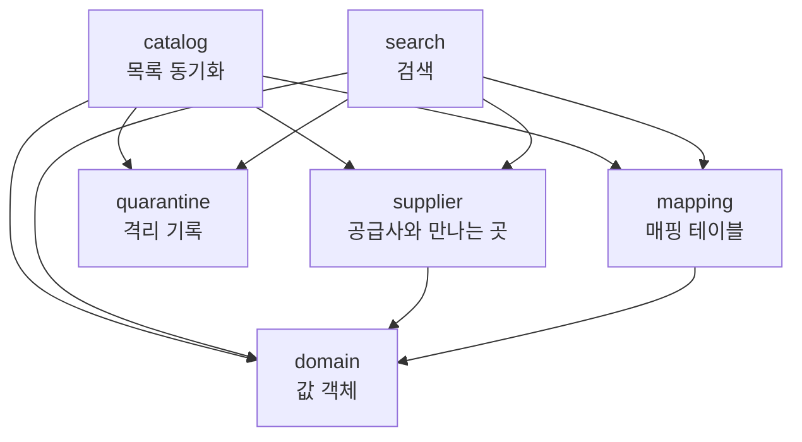

# 아키텍처

**지금 코드가 어떤 모양인가**를 한 장에 모은다. 패키지가 무엇을 맡고, 요청 하나가 어느 클래스를 지나며, 실패가 어디서 갈리는가다.

왜 그렇게 정했는지는 [ADR](adr/) 에, 말의 뜻은 [용어집](glossary.md) 에, 설정값의 근거는 [값 가이드](tuning.md) 에 있고
여기서 다시 적지 않는다. 이 문서는 결정을 링크만 한다.

동작을 서술한 줄에는 확인할 곳(파일 경로나 테스트 이름)을 붙였다. 테스트 이름은 `app/src/test/kotlin/com/stayaggregator` 아래에 있다.

## 1. 시스템 한 장

여러 공급사의 서로 다른 API 를 하나의 표준 모델로 통합해, 날짜와 인원으로 검색한 결과를 돌려준다.
바깥으로 열린 것은 검색 API 하나이고, 그 계약은 [api.md](api.md) 에 있다.

흐름은 둘이다. 둘이 만나는 곳은 매핑 테이블 하나뿐이다.

```
                      ┌──────────────────┐
   고객 ──  GET  ────▶│  search          │───┐
                      └──────────────────┘   │ 읽기 (missing_since 가 빈 것만)
                                             ▼
                                   ┌───────────────────┐
                                   │  mapping (DB)     │  hotel_mapping
                                   │                   │  room_type_mapping
                                   └───────────────────┘
                                             ▲
                      ┌──────────────────┐   │ 쓰기 (공급사 단위 트랜잭션)
   스케줄러 ────────▶│  catalog         │───┘
                      └──────────────────┘

   두 흐름 모두 supplier 의 어댑터로 공급사를 호출하고, 값을 정할 수 없어 뺀 것은 quarantine 에 남긴다.
```

| 흐름 | 언제 도는가 | 공급사에 무엇을 묻는가 | 결과가 어디로 | 확인 |
|---|---|---|---|---|
| 목록 동기화 | 기동 직후 한 번, 그 뒤 주기마다 ([ADR-0013](adr/0013-catalog-sync-on-startup-and-interval.md)) | 숙소 목록 API | 매핑 테이블 | `catalog/CatalogSyncScheduler.kt` |
| 검색 한 건 | 고객 요청마다 | 재고·요금 API | HTTP 응답. 저장하지 않는다 | `search/SearchController.kt` |

검색은 목록 동기화를 부르지 않는다 ([ADR-0014](adr/0014-detect-drift-in-search-correct-in-sync.md)).
패키지 방향이 그것을 거든다 → `ArchitectureTest.catalog 와 search 는 서로 보지 않는다`

## 2. 패키지와 의존 방향

패키지는 여섯이다. 하나는 값, 하나는 공급사와 만나는 곳, 둘은 저장소, 둘은 흐름이다.

| 패키지 | 무엇이 있나 | 경계의 기준 |
|---|---|---|
| `domain` | `StayPeriod` `GuestCount` `Money` `Rate` `RateConditions` `AvailableRoomType` `NormalizedHotel` `NormalizedRoomType` `Rejected` | 공급사도 유스케이스도 모르는 값. 값 검증이 이 생성자들에 있다 ([ADR-0041](adr/0041-validate-in-constructors.md), [ADR-0069](adr/0069-domain-package.md)) |
| `supplier` | 어댑터 인터페이스 셋(`CatalogAdapter` `AvailabilityAdapter` `SupplierAdapter`), `Fetched…`, `AvailabilityRequest`, `SupplierFailure`, `SupplierHttp`, `SupplierWebClient.kt`, `ResilientAvailabilityAdapter`, `SupplierCircuitBreakers`, `SupplierCallMetrics`, `SupplierRegistrationCheck`, `StayProperties`, 공급사별 하위 패키지 `a`·`b` | 공급사와 만나는 것 전부. 두 흐름이 모두 쓰므로 어느 흐름에도 두지 않는다 ([ADR-0040](adr/0040-package-structure.md)) |
| `mapping` | `ActiveMappingSource`, `MappingRepository`, `MappedHotel` | 매핑 테이블을 아는 유일한 곳. 동기화가 쓰고 검색이 읽는 유일한 공유물이다 (ADR-0040) |
| `quarantine` | `QuarantineRecorder`, `QuarantineRepository`, `QuarantineEntry`, `ExcludedValue` | 격리 기록 테이블을 아는 유일한 곳 ([ADR-0059](adr/0059-quarantine-package.md)) |
| `catalog` | `CatalogSyncScheduler`, `CatalogSyncService`, `CatalogNormalizer` | 목록 동기화 흐름 |
| `search` | `SearchController`, `SearchErrorHandler`, `SearchService`, `AvailabilityNormalizer`, `SearchResult`, `SearchResponse` | 검색 흐름 |

### 방향

정본은 [ADR-0069](adr/0069-domain-package.md) 의 문장이다.

> `catalog` 와 `search` 는 `domain`·`supplier`·`mapping`·`quarantine` 을 보고, 서로는 보지 않는다.
> `supplier`·`mapping`·`quarantine` 은 `domain` 만 본다. `domain` 은 아무것도 보지 않는다.



`quarantine` 은 지금 우리 패키지를 하나도 import 하지 않는다. 격리 기록에 넣는 값(`ExcludedValue`)이 그 패키지 안에 있기 때문이다
→ `quarantine/` 아래 `import com.stayaggregator.` 로 시작하는 줄이 없다

### 방향을 지키는 장치

Kotlin 의 `internal` 은 모듈 단위라 패키지 사이를 컴파일러가 막지 못한다 (ADR-0040). 그래서 둘로 지킨다 ([ADR-0072](adr/0072-adapter-http-helper-and-archunit.md)).

| 장치 | 언제 걸리나 | 무엇을 지키나 |
|---|---|---|
| `SupplierRegistrationCheck` | 기동 | `CatalogAdapter` 목록, `AvailabilityAdapter` 목록, 설정 블록 키가 모두 같은 집합인가 → `SupplierRegistrationCheckTest.한 인터페이스만 구현한 공급사가 있으면 기동에 실패한다` |
| `ArchitectureTest` (ArchUnit) | 테스트 | 아래 일곱 규칙 |

`ArchitectureTest` 의 규칙은 규칙 이름이 곧 내용이다 (`app/src/test/kotlin/com/stayaggregator/architecture/ArchitectureTest.kt`).

- `domain 은 아무 패키지도 보지 않는다`
- `supplier·mapping·quarantine 은 domain 만 본다`
- `supplier 와 mapping 과 quarantine 은 서로 보지 않는다`
- `catalog 와 search 는 서로 보지 않는다`
- `공급사 어댑터는 두 인터페이스를 함께 구현한다` — 하나만 구현하면 그 공급사가 한쪽 흐름에서 조용히 빠진다
- `WebClient 는 SupplierWebClient 에서만 만든다` — 연결 타임아웃과 인증을 빠뜨리지 않게 ([ADR-0066](adr/0066-connect-timeout-in-shared-webclient.md))
- `어댑터는 HTTP 응답을 직접 읽지 않는다` — 호출 타임아웃과 실패 변환의 순서를 `SupplierHttp` 가 쥐게 (ADR-0072)

## 3. 검색 한 건이 지나는 길

```
SearchController        요청 파라미터 → StayPeriod / GuestCount            거부되면 400
      │
SearchService           공급사마다 동시에, 공급사마다 검색 전체 타임아웃
      │
ActiveMappingSource     그 공급사의 검색 대상 매핑을 한 번에 읽는다
      │
      │                 숙소 코드를 50개 이하 chunk 로 나눈다 (동시 실행 수 제한)
      ├──────────────── chunk ─────────────────────────────────┐
      │                                                        │
ResilientAvailabilityAdapter   재시도 → 서킷 → 지표            │  ← 여기까지가 "공급사 호출"
      │                                                        │
SupplierAAdapter / SupplierBAdapter → SupplierHttp             │
      │                 bodyToMono → timeout → asSupplierFailure│
      │                 응답 DTO → Fetched…                     │
      │                                                        │
AvailabilityNormalizer  쓸 것 / 뺄 것 / 경고로 가른다           │  ← 감싼 어댑터 바깥이다
      │                                                        │
      └──────────────── chunk 결과 ────────────────────────────┘
      │
SearchService.combine   chunk 결과를 합치고, 뺀 것과 경고를 격리 기록에 넘긴다
      │
SearchResponse.from     내부 결과를 응답 계약 형식으로 옮긴다
```

| # | 단계 | 코드 | 정한 곳 | 확인 |
|---|---|---|---|---|
| 1 | 요청 파라미터를 값 객체로 만든다. 입력 검사는 그 생성자가 한다 | `search/SearchController.kt` | [ADR-0041](adr/0041-validate-in-constructors.md), [ADR-0043](adr/0043-stay-period-value-object.md), [ADR-0048](adr/0048-guest-count-invariants.md) | `SearchControllerTest.서비스에 넘기는 값은 요청 파라미터로 만든 값 객체다` |
| 2 | 공급사들을 동시에 호출하고, 하나가 실패해도 나머지로 응답한다 | `SearchService.search` | [ADR-0046](adr/0046-supplier-status-in-search-response.md) | `SearchServiceIntegrationTest.한 공급사가 실패해도 나머지 결과로 응답하고 실패한 공급사가 사유와 함께 드러난다` |
| 3 | 검색 전체 타임아웃을 공급사마다 건다. 넘긴 공급사만 실패가 된다 | `SearchService.searchSupplier` | [ADR-0045](adr/0045-search-concurrency-and-budget.md) | `SearchServiceIntegrationTest.검색 전체 타임아웃을 넘긴 공급사만 실패가 되고 나머지는 그대로 나간다` |
| 4 | 그 공급사의 검색 대상 매핑을 읽는다. 검색은 읽기 인터페이스만 본다 | `ActiveMappingSource.findActiveHotels` (구현은 `MappingRepository`) | [ADR-0037](adr/0037-missing-catalog-entries-kept-and-marked.md), [ADR-0073](adr/0073-small-design-fixes.md) | `MappingReadIntegrationTest.missing_since 가 찍힌 숙소는 읽지 않는다` |
| 5 | 숙소 코드를 50개 이하 chunk 로 나누고 동시 실행 수를 제한한다 | `SearchService.fetchAll`, `AvailabilityRequest.MAX_HOTEL_CODES` | ADR-0045 | `SearchServiceIntegrationTest.숙소가 50개를 넘으면 chunk 로 나눠 호출한다` |
| 6 | 감싼 어댑터가 재시도 → 서킷 → 지표를 붙여 호출한다 | `ResilientAvailabilityAdapter` | [ADR-0051](adr/0051-retry-transient-supplier-failures.md), [ADR-0056](adr/0056-circuit-breaker-per-supplier-outside-retry.md), [ADR-0060](adr/0060-supplier-call-metrics.md), [ADR-0071](adr/0071-resilience-as-adapter-decorator.md) | `SearchServiceIntegrationTest.공급사가 계속 실패하면 서킷이 열리고 그 뒤 검색은 그 공급사를 호출하지 않는다` |
| 7 | 어댑터가 공급사 스펙대로 HTTP 를 부르고 응답을 `Fetched…` 로 바꾼다 | `supplier/a/SupplierAAdapter.kt`, `supplier/b/SupplierBAdapter.kt`, `SupplierHttp` | [ADR-0031](adr/0031-supplier-adapter-boundaries.md), [ADR-0030](adr/0030-supplier-response-dto-receives-without-validation.md), ADR-0072 | `SupplierAvailabilityAdapterTest.공급사 A 에 숙소 코드 목록과 날짜와 인원을 스펙 이름으로 보낸다` |
| 8 | 쓸 것·뺄 것·경고로 가른다. 값이 유효한지는 값 객체가 검증한다 | `AvailabilityNormalizer.normalize` | [ADR-0027](adr/0027-spec-violation-handling-criteria.md), [ADR-0023](adr/0023-multi-night-availability-minimum.md), [ADR-0042](adr/0042-rate-as-tax-included-total.md) | `AvailabilityNormalizerTest.날짜별 요금은 세금까지 더한 총액이 되고 재고는 최솟값이 된다` |
| 9 | 뺀 것과 경고를 격리 기록에 넘긴다. 응답을 기다리게 하지 않는다 | `SearchService.combine` → `QuarantineRecorder.record` | [ADR-0055](adr/0055-quarantine-grouped-in-db.md), [ADR-0062](adr/0062-name-mismatch-warning.md), ADR-0073 | `SearchServiceIntegrationTest.스펙과 달라 뺀 항목은 격리 기록에 남는다` |
| 10 | chunk 결과를 공급사 하나의 결과로 합친다. 성공과 실패가 다른 타입이다 | `SearchService.combine`, `SupplierResult` (sealed) | [ADR-0050](adr/0050-partial-chunk-failure.md), ADR-0073 | `SearchServiceIntegrationTest.chunk 하나가 실패해도 다른 chunk 의 항목은 나가고 실패한 chunk 수가 실린다` |
| 11 | 내부 결과를 응답 계약 형식으로 옮긴다 | `SearchResponse.from` | ADR-0046 | `SearchControllerTest.응답에 요구된 최소 정보와 공급사별 상태가 실린다` |

### 이 흐름에서 눈여겨볼 두 가지

**기다리는 곳은 `SearchService` 한 곳이다.** 공급사 호출은 Reactor 로 조립하고, 마지막에 `block()` 으로 기다린다.
그 스레드가 가상 스레드라 기다리는 동안 OS 스레드를 붙잡지 않는다 ([ADR-0020](adr/0020-mvc-server-with-webclient.md), [ADR-0021](adr/0021-block-on-virtual-threads.md))
→ `SearchService.search` 의 `.block()`, `app/src/main/resources/application.yml` 의 `spring.threads.virtual.enabled`

**정규화는 감싼 어댑터 바깥에서 돈다.** `ResilientAvailabilityAdapter` 는 `delegate.fetchAvailability` 만 감싸고,
정규화는 `SearchService.fetchChunk` 가 그 뒤에 `.map` 으로 붙인다. 그래서 정규화에서 난 오류는 재시도되지도, 서킷과 지표에 세이지도 않는다
→ `supplier/ResilientAvailabilityAdapter.kt` 의 `fetchAvailability`, `search/SearchService.kt` 의 `fetchChunk`

## 4. 목록 동기화가 지나는 길

| # | 단계 | 코드 | 정한 곳 | 확인 |
|---|---|---|---|---|
| 1 | 기동 직후 한 번, 그 뒤로는 앞선 실행이 끝난 시점부터 주기마다 돈다. 주기가 1시간보다 짧으면 기동에 실패한다 | `CatalogSyncScheduler` | ADR-0013, [ADR-0016](adr/0016-catalog-sync-interval-default-daily.md), [ADR-0061](adr/0061-catalog-sync-min-interval.md) | `CatalogSyncSchedulerTest.주기가 1시간보다 짧으면 만들 수 없다` |
| 2 | 공급사를 차례로 돈다. 하나가 실패해도 나머지는 그대로 간다 | `CatalogSyncService.syncAll` → `sync` | [ADR-0019](adr/0019-first-catalog-failure-no-special-handling.md) | `CatalogSyncIntegrationTest.공급사 하나가 실패해도 다른 공급사는 반영된다` |
| 3 | 어댑터가 숙소 목록 API 를 부른다. 재시도도 서킷도 붙이지 않는다 | `CatalogAdapter.fetchCatalog`, `SupplierHttp.getCatalog` | ADR-0051, ADR-0056, ADR-0071 | `supplier/ResilientAvailabilityAdapter.kt` 가 재고·요금 어댑터만 감싼다 |
| 4 | 호출까지의 시간과 결과를 지표로 센다. 정규화·저장에서 난 오류는 공급사 지표에 넣지 않는다 | `CatalogSyncService.sync` → `SupplierCallMetrics.recordCatalog` | ADR-0060 | `catalog/CatalogSyncService.kt` 의 `try` 범위 |
| 5 | 쓸 것과 뺄 것을 가른다. 목록을 담는 필드가 없으면 그 공급사 실패다 | `CatalogNormalizer.normalize` | ADR-0027, ADR-0041 | `CatalogSyncIntegrationTest.목록 필드가 없는 응답은 기존 표시를 건드리지 않는다` |
| 6 | 뺀 항목을 격리 기록에 넘긴다 | `QuarantineRecorder.record` | ADR-0055 | `QuarantineIntegrationTest.같은 문제가 여러 번 오면 한 행에 횟수가 늘고 마지막 사유와 원본이 바뀐다` |
| 7 | 매핑에 반영한다. 그 공급사 행을 모두 `missing_since` 로 표시한 뒤 이번 목록에 있는 것만 비운다. 공급사 하나가 한 트랜잭션이다 | `MappingRepository.applyCatalog` | [ADR-0038](adr/0038-catalog-sync-execution.md), ADR-0037 | `CatalogSyncIntegrationTest.목록에서 빠지면 missing_since 가 기록되고 다시 나타나면 비워진다` |
| 8 | 공급사를 다 돈 뒤, 오래 보지 않은 격리 기록을 지운다. 새 스케줄을 만들지 않는다 | `CatalogSyncService.syncAll` → `QuarantineRecorder.purgeExpired` | ADR-0055 | `QuarantineIntegrationTest.마지막으로 본 시각이 기준보다 오래된 행만 지운다` |

격리 기록은 매핑 반영보다 **먼저** 넘긴다(5 → 6 → 7). 격리 쓰기는 비동기라 순서가 응답이나 트랜잭션에 걸리지 않는다
→ `catalog/CatalogSyncService.kt` 의 `sync`

트랜잭션이 HTTP 호출을 감싸지 않는다. 공급사 호출이 끝난 뒤에 저장이 시작된다 (ADR-0038)
→ `CatalogSyncService.sync` 가 `block()` 으로 받은 뒤에 `repository.applyCatalog` 를 부른다

## 5. 실패가 흐르는 길

공급사마다 실패를 알리는 방법이 다르다. A 는 HTTP 상태 코드로, B 는 항상 200 을 주고 본문의 결과 코드로 알린다.
그 차이를 두 곳에서 흡수해 **한 가지 예외 타입**(`SupplierFailure`, sealed)으로 만든다 (ADR-0027, [ADR-0070](adr/0070-supplier-failure-sealed.md)).

| 어디서 | 무엇을 바꾸나 | 코드 |
|---|---|---|
| HTTP 계층 | 상태 코드, 연결 실패, 타임아웃 | `supplier/SupplierFailure.kt` 의 `asSupplierFailure` (`SupplierHttp` 가 붙인다) |
| 본문 계층 | B 의 `resultCode` | `SupplierBAdapter.failIfNotSuccess` |
| 정규화 | 목록·항목을 담는 필드가 없음 | `CatalogNormalizer`, `AvailabilityNormalizer` 가 `SupplierFailure.Unreadable` 을 던진다 |
| 동기화 | 응답이 비어 있음 | `CatalogSyncService.sync` |

확인 → `SupplierAvailabilityAdapterTest.공급사 B 가 본문 결과 코드로 알린 실패는 목록 인터페이스와 같은 오류가 된다`

### 종류와, 종류가 가르는 것

재시도 가능 여부는 **종류가 들고 다니고, 실제로 재시도할지는 호출하는 쪽이 정한다** (ADR-0051).
검색은 재시도하고 목록 동기화는 하지 않는다.

| 종류 | 무엇 | 주로 어디서 생기나 | `transient` | 검색의 재시도 | 서킷이 실패로 세나 | 지표 `outcome` |
|---|---|---|---|---|---|---|
| `Timeout` | 정한 시간 안에 오지 않음 | `classify` (우리 `Mono.timeout`, Netty 연결·읽기 타임아웃) | `false` | 안 함 | 센다 | `timeout` |
| `Throttled` | 요청 한도 초과 | `classify` (429), `SupplierBAdapter` (`E429`) | `true` | 다른 기준으로 (더 오래 기다리고 덜) | 센다 | `supplier_failure` |
| `Unavailable` | 지금은 처리 못 함, 연결 거절 | `classify` (5xx·요청 단계 실패), `SupplierBAdapter` (`E5…`) | `true` | 함 | 센다 | `supplier_failure` |
| `Rejected` | 요청을 거절당함 | `classify` (그 밖의 4xx), `SupplierBAdapter` (그 밖의 코드) | `false` | 안 함 | 센다 | `supplier_failure` |
| `Unreadable` | 응답은 왔지만 스펙대로 읽지 못함 | `classify` (그 밖), 정규화, 동기화 | `false` | 안 함 | 정규화가 던진 것은 서킷 바깥이라 세지 않는다 (3절) | `supplier_failure` |
| `CircuitOpen` | 서킷이 열려 호출하지 않음 | `ResilientAvailabilityAdapter` 만 | `false` | 안 함 | 서킷 연산자 뒤에서 만들어 세지 않는다 | `circuit_open` |

확인 → `SupplierFailureTest`, `SupplierCallMetricsTest.실패 종류마다 결과 태그가 다르다`,
`supplier/SupplierCallMetrics.kt` 의 `outcomeOf`, `supplier/SupplierCircuitBreakers.kt` 의 `ignoreException`

**공급사 실패가 아닌 오류(우리 결함)는 따로 센다.** 서킷은 성공으로도 실패로도 세지 않고, 지표는 `internal_error` 로 나눈다
→ `SearchServiceIntegrationTest.공급사 실패가 아닌 내부 오류는 서킷이 성공으로도 실패로도 세지 않는다`,
`SupplierCallMetricsTest.공급사 실패가 아닌 내부 오류는 공급사 실패에 섞지 않는다`

### 예외가 결과로 바뀌는 지점

```
공급사 호출 실패
   │
   ├─ 재시도 (transient 만)                ResilientAvailabilityAdapter
   ├─ 서킷 (재시도까지 거친 최종 결과)      ResilientAvailabilityAdapter
   ├─ 지표 (같은 단위)                     ResilientAvailabilityAdapter
   │
   ▼
SearchService.fetchChunk     onErrorResume → ChunkOutcome.Failed(reason)   ← 다른 chunk 는 계속 간다
   │
   ▼
SearchService.combine        성공한 chunk 가 하나도 없으면 SupplierResult.Failed
   │                         하나라도 있으면 Succeeded + failedChunks
   ▼
SearchService.searchSupplier onErrorResume → SupplierResult.Failed(reason) ← 매핑 읽기 실패, 검색 전체 타임아웃
   │
   ▼
SearchResponse               suppliers[].status / failureReason
```

목록 동기화 쪽은 갈림이 하나다. `CatalogSyncService.sync` 가 `SupplierFailure` 를 잡아 그 공급사만 건너뛰고 로그를 남긴다.
공급사가 알린 실패가 아닌 것은 스택까지 남긴다
→ `CatalogSyncIntegrationTest.공급사가 알린 실패가 아니어도 다른 공급사는 반영된다`

**항목 하나의 문제는 예외로 올리지 않는다.** 값 객체의 거부(`Rejected`)만 항목 제외 사유로 받고, 그 밖의 예외는 우리 결함이라 삼키지 않는다 (ADR-0073, [ADR-0067](adr/0067-rejection-carries-field.md))
→ `search/AvailabilityNormalizer.kt` 의 `step`, `catalog/CatalogNormalizer.kt` 의 `build`

요청 입력의 거부도 같은 `Rejected` 계열이라 `SearchErrorHandler` 가 400 으로 바꾼다. 4절이 아니라 [api.md](api.md) 가 그 계약을 맡는다.

## 6. 저장하는 것과 저장하지 않는 것

| | 저장하나 | 어디에 | 왜 |
|---|---|---|---|
| 공급사 코드와 내부 식별자의 매핑 | **한다** | `hotel_mapping`, `room_type_mapping` | 재고·요금을 조회하려면 숙소 코드를 우리가 들고 있어야 한다 ([ADR-0017](adr/0017-mapping-in-server-rdb.md)) |
| 숙소명·객실 타입명·최대 수용 인원 | **한다** | 위 두 테이블 | 드물게 바뀌므로 저장해 두고 응답에 쓴다 ([ADR-0012](adr/0012-static-info-from-catalog.md)) |
| 값을 정할 수 없어 뺀 항목과 경고 | **한다** | `quarantine_record` | 같은 문제를 한 행으로 그룹화해 횟수와 마지막 원본을 남긴다 (ADR-0055, ADR-0062) |
| 재고·요금 | **안 한다** | — | 매번 바뀌므로 검색마다 공급사에 묻는다 |
| 공급사 HTTP 응답 원문 | **안 한다** | — | 숙소 50개가 한 덩어리라 항목 하나를 떼기 어렵다 (ADR-0055) |
| 검색 결과 | **안 한다** | — | 캐시는 [ADR-0065](adr/0065-availability-cache-redis.md) 로 정했고 아직 코드가 없다 |

스키마는 두 곳에 있다. 컬럼의 뜻은 [용어집의 테이블 절](glossary.md#테이블) 에, 실제 DDL 은 `app/src/main/resources/db/migration/` 에 있다.
스키마 변경은 Flyway 스크립트로만 한다 ([ADR-0033](adr/0033-flyway-for-schema-migration.md)).

## 7. 확장 지점

"새 X 가 추가되면 어디를 고치나"의 답이다.

| 새로 생기는 것 | 어디에 넣나 | 고치지 않는 곳 |
|---|---|---|
| **새 공급사** | `supplier/<id>/` 아래 어댑터 하나와 응답 DTO 둘, `application.yml` 의 설정 블록 하나. 자세한 표는 [README](../README.md#새-공급사를-붙이려면) 에 있다 | `catalog`·`search`·`mapping`·`domain` |
| **새 요금 형식** | `FetchedPricing` 의 sealed 하위 타입 하나. `AvailabilityNormalizer.rate` 의 `when` 이 컴파일되지 않아 고칠 곳이 드러난다 | 어댑터 인터페이스, 응답 계약 |
| **새 인증 방식** | `apiKeyHeader` 옆에 `ExchangeFilterFunction` 하나. 어댑터가 고른다 (ADR-0072) | `supplierWebClient` 안에 분기가 생기지 않는다 |
| **새 consumer**(예약 대행 등) | `ResilientAvailabilityAdapters` 를 주입받으면 재시도·서킷·지표가 따라온다 (ADR-0071). 예약 대행은 설계만 있다 ([ADR-0064](adr/0064-reservation-proxy-design-only.md)) | 정책을 복사하지 않는다 |
| **매핑을 DB 아닌 곳에서 읽기** | `ActiveMappingSource` 구현 하나. 검색은 이 인터페이스만 본다 (ADR-0073) | `SearchService` |
| **요금·재고 캐시** | 결정은 ADR-0065 에 있고 코드는 아직 없다 | — |

새 공급사가 늘어도 검증 규칙은 한 곳이다. 공급사마다 다른 것(실패 표현, 필드 이름, 요금 구조)만 어댑터가 흡수하고,
값을 쓸 수 있는지 보는 규칙은 값 객체와 정규화에 있다 (ADR-0031, ADR-0041)
→ `CatalogSyncIntegrationTest.공급사를 하나 더 붙여도 consumer 코드를 고치지 않는다`
